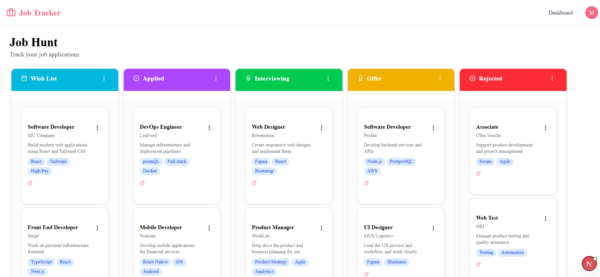

🗂️ Job Tracker — My First Next.js Project

A full-stack Kanban-style job application tracker built with Next.js 16, MongoDB, and Better Auth.

This is my first Next.js project, where I learned App Router, Server Actions, authentication, and drag-and-drop — all in one real-world app.

💡 Built by following a YouTube tutorial and customized with my own improvements.

📸 Preview

Add a screenshot of your dashboard here

Example: 

✨ Features

🔐 Sign up & login with email/password (Better Auth)
🗃️ Kanban board with 5 columns: Wish List, Applied, Interviewing, Offer, Rejected
🖱️ Drag & drop job cards between columns (dnd-kit)
➕ Add, edit, and delete job applications
🌱 Seed script to populate default job data on first run
📱 Responsive layout

🛠️ Tech Stack

CategoryTechnologyFrameworkNext.js 16 (App Router)LanguageTypeScriptStylingTailwind CSS v4DatabaseMongoDB Atlas + MongooseAuthenticationBetter AuthDrag & Dropdnd-kitUI Componentsshadcn/ui + Radix UIIconsLucide React

📁 Project Structure

job-application-tracker/
├── app/
│   ├── api/              # API routes (Better Auth)
│   ├── dashboard/        # Main Kanban board page
│   └── sign-in/          # Login & Sign up pages
├── components/
│   ├── ui/               # shadcn/ui components
│   ├── kanban-board.tsx  # Main Kanban component
│   ├── job-application-card.tsx
│   └── create-job-dialog.tsx
├── lib/
│   ├── actions/          # Server Actions (create, update, delete)
│   ├── auth/             # Better Auth config
│   ├── hooks/            # useBoards custom hook
│   ├── models/           # Mongoose models (Board, Column, JobApplication)
│   └── db.ts             # MongoDB connection
├── scripts/
│   └── seed.ts           # Seed script for default job data
└── .env.local            # Environment variables (not committed)

🚀 Getting Started Locally

1. Prerequisites

Node.js 18 or higher
A MongoDB Atlas account (free tier is enough)

2. Clone the repository

powershellgit clone https://github.com/mobina-violet/job-application-tracker.git
cd job-application-tracker

3. Install dependencies

powershellnpm install

4. Set up environment variables

Create a .env.local file in the root of the project and add the following variables:

envMONGODB_URI=your_mongodb_connection_string
BETTER_AUTH_SECRET=your_random_secret_string
BETTER_AUTH_URL=http://localhost:3000

MONGODB_URI: Get this from MongoDB Atlas:

Atlas → Cluster → Connect → Drivers → copy the connection string

BETTER_AUTH_SECRET: Any random string works. You can generate one with:

powershellnode -e "console.log(require('crypto').randomBytes(32).toString('hex'))"

5. Run the development server

powershellnpm run dev

Then open your browser and navigate to:

http://localhost:3000

6. Sign up & seed default data

Click Sign Up and create an account
After signing up, go to MongoDB Atlas and copy the _id of your user from the user collection
Open scripts/seed.ts and find this line:

tsconst USER_ID = "your_user_id_here";

Replace it with your actual user _id, then run:

powershellnpx tsx --env-file=.env.local scripts/seed.ts

Refresh the dashboard — you should now see 15 default job applications 🎉

📜 Available Scripts

powershellnpm run dev        # Start development server on localhost:3000
npm run build      # Build for production
npm run start      # Start production server
npm run lint       # Run ESLint

🔐 Environment Variables

VariableDescriptionMONGODB_URIMongoDB Atlas connection stringBETTER_AUTH_SECRETSecret key for Better Auth sessionsBETTER_AUTH_URLBase URL of the app (http://localhost:3000 for local)

🧠 What I Learned

This was my first Next.js project, and here's what I picked up:

App Router — file-based routing with page.tsx, layout.tsx, and loading.tsx
Server Components vs Client Components — knowing when to use "use client"
Server Actions — type-safe data mutations without writing API routes
MongoDB + Mongoose — modeling relationships between Board → Columns → Jobs
Better Auth — email/password auth with database hooks for auto-setup on signup
dnd-kit — drag-and-drop with sortable context and droppable zones
Tailwind CSS v4 — utility-first styling with custom CSS classes

🙋‍♀️ About Me

I'm Mobina, a junior frontend developer building my portfolio with React, TypeScript, and Next.js.

This is the first full-stack project I built with Next.js — feel free to explore the code!

🔗 GitHub: @mobina-violet

📄 License

This project was built for learning purposes, following a YouTube tutorial by @machadop1407.
You can check out [the Next.js GitHub repository](https://github.com/vercel/next.js) - your feedback and contributions are welcome!

## Deploy on Vercel

The easiest way to deploy your Next.js app is to use the [Vercel Platform](https://vercel.com/new?utm_medium=default-template&filter=next.js&utm_source=create-next-app&utm_campaign=create-next-app-readme) from the creators of Next.js.

Check out our [Next.js deployment documentation](https://nextjs.org/docs/app/building-your-application/deploying) for more details.
